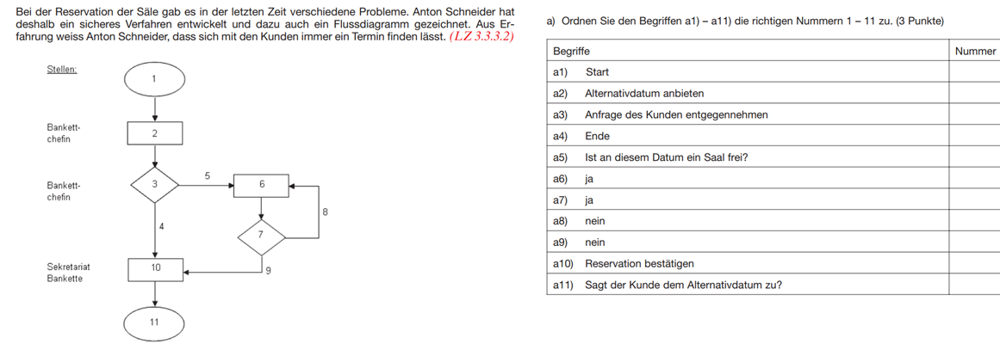

# Flussdiagramme

Ein Flussdiagramm oder auch Ablaufdiagramm bezeichnet, veranschaulicht in der Organisationslehre einen Arbeitsablauf, indem es eine Abfolge von Entscheidungen und Anweisungen vorschreibt. Üblicherweise entspricht dabei ein Symbol im Diagramm einem Zustand oder einem Zustandswechsel, und ein konkreter Ablauf entspricht einem Pfad durch das Diagramm. Üblicherweise enthält ein Ablaufdiagramm optionale Pfade und somit fallspezifische Anweisungen.

Neben der Illustration von Algorithmen eignen sich Ablaufdiagramme zur Darstellung von Prozessen und Tätigkeiten, beispielsweise zur Entscheidungsfindung in Reparaturanleitungen, zur Darstellung von Geschäftsmodellen und in der medizinischen Diagnostik.

Es gibt viele verschiedene Arten von Flussdiagrammen  (Programmablaufplan (PAP Flowchart), Nassi-Shneiderman-Diagramm oder das Jackson-Diagramm - beide kaum mehr verwendet. Eine weitere verwandte Darstellungsform ist der Entscheidungsbaum und Teile der UML Notation. Insbesondere durch die weitere Verbreitung der Grafischen Programmierung und der Low-Code-Programming gewinnen Flussdiagramme wieder an Bedeutung.

## Notation:

## Beispiel:

|                                                              |                                                              |
| ------------------------------------------------------------ | ------------------------------------------------------------ |
|  |  |

## Übung

<!--Lehrerversion -->

<!-- End Lehrerversion -->